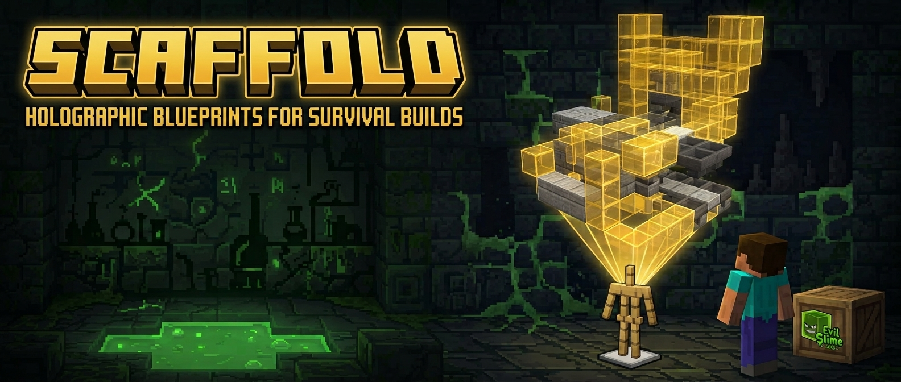
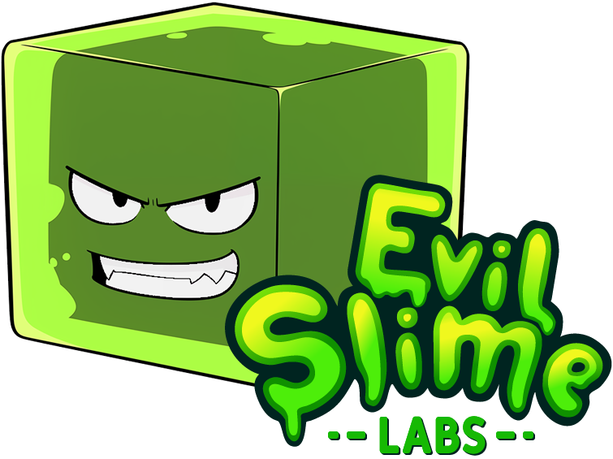

# Scaffold launched with massive updates from Structura!

- **Fully updated to Minecraft 26.45!** Every block the vanilla resource pack defines now has a shape and a texture, and all 108 bundled test structures build with nothing skipped at all.
- **Increased geometry! (Optionally!)** Complex blocks now have the option for higher detail! But also unnecessary geometry has been reduced for better performance.
- **So many block fixes!** Many small issues with block rendering and orientation have been resolved, ensuring that your builds look exactly as intended.
- **Mob heads!** built from the game's own models: player, zombie, skeleton, wither skeleton, creeper, piglin and dragon, on the floor or on a wall, through all sixteen rotations.
- **Single file!** `Scaffold.exe` is a single self-contained program. No Python, no dependencies, nothing to extract. You can also use it on the command line, or download `Scaffold-cli.exe` for a command line only experience.
- **Full update support!** The program automatically checks for new releases and can update itself in place.
- **Modern interface!** Modern design. Drag and drop. Light or dark theme. Settings that remember your preferences.
- **Translations!** Languages can now easily be added with a single file for each language.
- **And more!**

# About

Scaffold (previously Structura) turns a `.mcstructure` file into a Minecraft Bedrock resource pack. The pack replaces the armor stand so it renders when off screen and carries every block of your build as a bone in its model, drawn as semi-transparent *ghost blocks* that show you exactly where the real blocks go. Inspired by Litematica, and it needs no behaviour pack, no commands and no cheats, only a resource pack and an armor stand, so it works in a survival, achievements-on world.

[](https://www.youtube.com/watch?v=IdKT925LKMM)

*(The video shows an older version. The program it demonstrates now looks like the screenshots below, but the idea and the in-game result are the same.)*

---

## Breaking changes from Structura 1.7

Scaffold is distributed as **single-file Windows executables** now, one for the window and one for the command line. You are not expected to install Python or run any of the source directly, and everything below follows from that. On macOS and Linux the command line installs from PyPI instead; see [Installing it instead](#installing-it-instead).

| Was | Is now |
| --- | --- |
| `python scaffold.py` | `Scaffold.exe`. Double-click for the window, or give it arguments in a terminal and it builds there instead |
| `python scaffold_cli.py` | `Scaffold-cli.exe`, the same command line with the window left out of the build; from a checkout, `python -m scaffold.cli` |
| `sh start.sh` on Linux | `pip install mcpe-scaffold` and the `scaffold-cli` command; the script is gone |
| **Bundle TechPack** on/off | a **TechPack** menu with three settings, described under [TechPack](#techpack). The default is now **None**; a pack that used to be built with the toggle on wants **Full Pack** |
| Basic and Advanced screens | one screen |

**Idempotent builds**
A pack's identity is now derived from its contents, meaning the structures, the transparency, the icon, the description and every setting, rather than from its name alone. Rebuilding an unchanged pack produces an identical pack that Minecraft will recognize as the same one.

For anyone working on the source rather than using it: everything importable is now one `scaffold` package, so `from scaffold import Scaffold` replaces `scaffold_core.scaffold`, and the entry points are `python -m scaffold` for the window and `python -m scaffold.cli` for the command line.

---

## 1. Export a structure from Minecraft

Get a structure block. In a creative world with cheats on, run
`/give @s structure_block`.


Set the structure block over your build and select every block you want in the ghost model. A single structure block covers at most **64×64×64** without editing your world's NBT data.


Press **Export** at the bottom to save it to a file. Note where it goes; you need it in a moment.


---

## 2. Build the pack

Download `Scaffold.exe` and run it. That is the whole install, because it is a single self-contained file with everything inside it, so there is no folder to keep together and nothing to extract. A zip of the same executable is published alongside it, for browsers and chat clients that refuse a bare `.exe`.


Drop your `.mcstructure` file onto the window, or click the add area to browse for it. Give the pack a name, and press **Make Pack**.

Each structure sits on its own row. Click the file name to swap in a different file without losing the row, or the ✕ to drop it.

The first structure you add names the pack, if you have not named it yourself, and taking that structure back out again clears the name with it. Anything you type over the suggestion is yours and stays.

That is the whole flow. Everything else is optional:

| Setting | What it does |
| --- | --- |
| **Pack icon** | Click the preview to choose your own image. A small ✕ on it returns to the Scaffold icon. |
| **Short description** | Up to 25 characters, shown in the pack list in game. |
| **Block Transparency** | How see-through the ghost blocks are. 0 is solid, higher is fainter. Defaults to 65. |
| **Offset** | Moves the ghost model relative to the armor stand, per structure. |
| **Big Build Mode** | For builds larger than one structure block; see below. |
| **Make Block Lists** | Writes a text file of every block the build needs, beside the pack. |
| **Low Geometry** | Draws the most detailed blocks as simpler shapes, and is remembered; see below. |
| **TechPack** | What to do about the Bedrock Technical Resource Pack; see below. |
| **Output folder** | Where finished packs land. Defaults to `Scaffold Builds` in your Documents, and is remembered. |

**Name tags.** With a single structure the name tag is optional. Add a second and it becomes required, because the tag is how you tell the armor stands apart: name an armor stand `north wing` and it shows that structure. The window says so as you type.


**Big Build Mode** is for builds too large for one structure block. Export the build in pieces, add them all, and Scaffold assembles them into one model spread across the armor stand's layers.

The name tag fields step aside while it is on, because big build mode names its own models, and the offset becomes the **Corner** of the whole assembly. **Get Global Cords** fills that in for you: every `.mcstructure` records where in the world it was taken from, so the corner is the lowest of those origins, and the ghost model lands back where the pieces came from without you reading coordinates off the structure blocks.

Turning it off gives you your name tags and per-structure offsets back exactly as they were.


When the pack is written you get told, with the path and anything that had to be skipped:


**Theme and language** sit in the bottom right, alongside a **?** that opens the issue tracker and an **i** that says who made this. The theme follows your desktop by default; light and dark are there if you would rather pin it.


**Updates.** Scaffold checks for a newer build when it starts, and offers to install it. Taking it replaces the executable you are running and starts the new one; your settings and your structures are untouched. The check, and a switch to stop it happening at launch, are in **About**. It is the only thing Scaffold sends anywhere, and turning the switch off stops it entirely.

**An update has to be signed to be installed.** Scaffold uses [The Update Framework](https://theupdateframework.io), the same approach package managers use: the release carries metadata signed with keys that never go near the server, and a build ships with the public root it checks everything against. Something that is not signed by the project is refused, whoever is serving it. If you are on a release candidate you keep being offered release candidates; a final release is only offered final releases.

`SHA256SUMS.txt` still travels with every release for anyone downloading the zip by hand: `sha256sum -c SHA256SUMS.txt` checks it.

Your theme, language, output folder, TechPack choice, Low Geometry switch, block transparency and whether to check for updates are remembered in a `.scaffold` file. Scaffold looks for one **next to the executable** first, so putting it there makes the program portable, carrying its settings on a stick and touching nothing on the host. Otherwise it uses, and creates, one in your home directory.

### Block lists

A block list is the shopping list for a build: what to gather, and how much of it. Scaffold writes one per name tag, named and grouped so it reads like something a person would hold:

```
Blocks needed for this build - east wing
______________________________

Oak
  Oak Planks: 384
  Oak Stairs: 96

Cobblestone
  Cobblestone: 128
  Cobblestone Wall: 24

Glass
  Glass Pane: 40
______________________________
```

**Wood and stone are grouped by what they are, not by what shape they are cut into**, so everything oak is in one pile and everything deepslate in another, rather than every stair in the build sitting together. Concrete, wool, glass and terracotta each get their own heading, and the things you gather as items -- flowers, crops, saplings -- are kept out of the block headings entirely.

**You can supply your own names and your own headings.** Both live in one file, `block_list.json`, and Scaffold looks for a copy of yours in the same two places it looks for settings: next to the executable first, then your home directory, under the name `.scaffold-blocks.json`. **Scaffold never writes to either** -- the file is yours, and one it rewrote would be one it could lose your edits in.

What it finds is merged over what ships, so a rename is a four-line file:

```json
{ "names": { "minecraft:cobblestone": "Cobble" } }
```

`categories` works the other way: the order is the whole point of it, so a file that carries any categories at all replaces the list outright. Each one is a name and a list of patterns matched against the block id, `*` standing for any run of characters, and the first category that matches wins:

```json
{ "categories": [
    { "name": "Get these first", "match": ["*_shulker_box", "ender_chest"] },
    { "name": "Everything else", "match": ["*"] }
] }
```

A pattern can also match a block's variant, written after a slash, which is how the stone slabs from before Minecraft flattened its block names land with the stone they are cut from: `*/quartz` is "a quartz one of anything". A `*` never crosses that slash.

Anything no category matches goes under **Other** rather than being dropped.

### Languages

English, Українська, Español, 简体中文, Tagalog and Cebuano, plus five that are not serious about it: Pirate Speak, LOLCAT, Shakespearean, upside-down English and the enchanting table alphabet.

Each is labelled by its language code rather than a flag, because a flag is a country and several countries share a language. Adding one is a file named for its locale, the way Minecraft names its own, and nothing else: see the [Translation Guide](docs/TRANSLATION.md).


---

## 3. Use the pack in game

Apply the `.mcpack` like any resource pack. Enabling it in your **global resources** works well.


Your structure now appears around **every armor stand** in the worlds you load. That is how it works without a behaviour pack. Place an armor stand where the build should go.


**Shift-right-click** the armor stand to step through the build a layer at a time. Layers 12 blocks apart share a step, so a tall build shows more than one layer at once.


---

## Low Geometry

Every ghost block is real geometry, and the game lights and draws each one. Vibrant Visuals makes that markedly more expensive, so a large build of detailed blocks can be demanding to render.

**Low Geometry** redraws only the blocks that carry the most detail, such as bells, beacons, hanging signs and copper golem statues, as simpler shapes. They keep their textures and their positions, so the build still reads correctly, and they are only cheaper to display. Blocks that are already a cube or two are untouched, which is most of them.

On a structure made entirely of detailed blocks it removes about two cubes in five. On an ordinary build it changes almost nothing, because there is almost nothing to simplify.

A pack built this way is a different pack from the same build at full detail, so the two do not overwrite each other in your list.

Pass `--low_geometry` on the command line for the same thing.

---

## TechPack

Scaffold can work with the [Bedrock Technical Resource Pack](https://github.com/EvilSlimeLabs/Bedrock-Technical-Resource-Pack) in one of three ways, chosen from the **TechPack** menu or with `--tech_pack` on the command line.

**Why this needs a setting at all.** Both Scaffold and TechPack replace the game's armor stand entity, and a resource pack *replaces* that file rather than merging with it, so between two packs only the one higher in your list is read at all. Applying them side by side does not half-work: whichever sits lower is ignored completely, so you either lose the ghost blocks or you lose every TechPack visualisation, depending on the order. No ordering gives you both.

| Choice | What you get |
| --- | --- |
| **None** | Scaffold alone. This is the default. |
| **Compatibility** | The generated pack declares TechPack on the armor stand but ships none of its files, so **your own** installed copy of TechPack keeps working alongside it. Keep both packs applied. |
| **Full Pack** | The generated pack carries TechPack's declarations *and* its assets, so this one pack is both. Apply only the generated pack, and remove or disable the standalone TechPack while it is active. |

Compatibility is the one to reach for if you already keep TechPack up to date yourself. Full Pack is the one to reach for if you would rather hand somebody a single file.

The bundled copy is whatever version of TechPack shipped with your Scaffold build; it does not update on its own. For a newer TechPack, take a newer Scaffold release or update the `be_tech_pack` submodule and rebuild.

---

## Command line

**`Scaffold.exe` is both programs.** Double-click it and the window opens; give it arguments in a terminal and it builds a pack there instead and prints where it landed.

```bash
Scaffold.exe --structure path/to/build.mcstructure --pack_name "CLI Pack" --overwrite
```

`Scaffold-cli.exe` is the same command line with the window left out of the build, a smaller download for scripts, servers and batch jobs. It takes exactly the same arguments. The only difference is that running it with nothing to build tells you so instead of opening a window.

`--opacity` (1–100, the inverse of the window's transparency slider), `--description`, `--icon`, `--output`, `--offset x,y,z`, `--low_geometry`, `--tech_pack none|compatibility|full` and `--overwrite` are all available. `--help` lists them. Without `--output` the pack lands in the same folder the window uses.

A pack that is already there stops the build and names the file, because the command line has nobody to ask. `--overwrite` is how you say to write over it.

### Installing it instead

On Windows you do not need to, because the executables need nothing installed. On **macOS and Linux the package is how you run Scaffold**, and it is also the easier route on Windows for scripting and for anything that wants to `import scaffold`. Any platform with **Python 3.11 or newer** will do:

```bash
pip install scaffold
scaffold-cli --structure build.mcstructure --pack_name "My Pack"
```

Everything travels with it, including the lookup tables, the vanilla textures, the fonts and TechPack's assets, so `--tech_pack full` works from an install exactly as it does from the executable. Packs built this way are identical to packs built by the executable.

**The window is Windows only.** It is written on CustomTkinter, which is Tk underneath, and Tk on macOS and Linux has not been tested and is not supported. A `scaffold[gui]` extra exists and will install its dependencies anywhere, but only Windows is claimed to work. Tkinter itself is never on PyPI: it comes with CPython on Windows and macOS, and is a system package on Linux (`python3-tk` on Debian and Ubuntu, `python3-tkinter` on Fedora).

If you do install the extra on Windows, `scaffold` with no arguments opens the window. It is a console script rather than a windowed one, so a console flashes up first, which is the one thing `Scaffold.exe` does better.

From a checkout, `python -m scaffold` and `python -m scaffold.cli` are the same two programs without installing anything.

## Building a release

Releases are built locally, on **Windows**. This is the complete path from a fresh clone to a working `dist/Scaffold.exe`, in order.

### 1. Clone the repository

```bash
git clone https://github.com/EvilSlimeLabs/Scaffold.git
cd Scaffold
```

**Skip `--recurse-submodules`.** `CommunityVanillaResourcePack` and `be_tech_pack` are reference material for `tools/vendor/`, not something an ordinary build reads: what they produce is already staged and committed under `scaffold/Vanilla_Resource_Pack` and `scaffold/techpack`. Only clone them (`git submodule update --init`) if you are updating the vendored assets themselves, with `python -m tools.vendor.vanilla_pack` or `python -m tools.vendor.tech_pack`.

### 2. Install Python and the build dependencies

Scaffold needs **Python 3.11 or newer**. Get it from [python.org](https://www.python.org/downloads/) if it is not already on the machine, and tick "Add python.exe to PATH" in the installer.

```bash
python -m pip install -e ".[dev]"
```

This installs Scaffold itself in editable mode, along with everything a build needs: CustomTkinter and the rest of the window's dependencies, `fonttools` for the bundled typefaces, and `nuitka` for the compile.

### 3. Install a C compiler

Nuitka is a compiler, not a bundler: it turns the program into C and hands that to a real C compiler, so one has to be on the machine. There is nothing to install here if you only want to *run* Scaffold from a checkout — this step is for building a release.

`build.py` asks for **[Zig](https://ziglang.org)** with Nuitka's `--zig`, and **you do not have to install it yourself.** Nuitka downloads the toolchain the first time it needs it and keeps it up to date, the same way it used to handle MinGW64. The first build takes noticeably longer while that happens, and it needs to reach the network; every build after that is fast.

Two other compilers work if you would rather use one you already have, by editing `COMPILER` at the top of `build.py`:

| Compiler | How |
| --- | --- |
| Zig | `--zig`, the default. Downloaded by Nuitka. x86-64 only on Windows. |
| Visual Studio 2022 or newer | set `COMPILER = None`; Nuitka uses it when it is installed |
| MinGW64 | `--mingw64`, and **only up to Python 3.12**. Nuitka does not support it on 3.13 or newer, which is why it is not the default here. |

**Install VS 2022 Build Tools regardless of which compiler you pick.** `Scaffold.exe` links against the Visual C++ runtime (`msvcp140.dll`, `vcruntime140.dll`), and Nuitka can only bundle those DLLs into the executable if Visual Studio is on the build machine — it does not matter that Zig is doing the actual compiling. Microsoft's licence terms make Visual Studio the only place those files may be redistributed from. Without them the build still succeeds, but the executable fails to start on a machine that does not already have the Visual C++ Redistributable installed.

**The C++ workload is the part that matters**, not the Build Tools shell. Nuitka copies from `VC\Redist\MSVC\` inside the installation, and that directory only exists once `Microsoft.VisualStudio.Workload.VCTools` is installed; the bare `winget install Microsoft.VisualStudio.2022.BuildTools` lays down MSBuild and nothing else. So pass the workload through to the Visual Studio installer:

```bash
winget install --id Microsoft.VisualStudio.2022.BuildTools -e --override "--quiet --wait --norestart --add Microsoft.VisualStudio.Workload.VCTools --includeRecommended"
```

Nuitka says which way it went. `Cannot find Windows Runtime DLLs to include, requiring them to be installed on target systems` means it found nothing to copy; `Including Windows Runtime DLLs, which increases distribution size` means it did.

### 4. Build

The version comes from `[project] version` in `pyproject.toml`, so bump that first, then:

```bash
python build.py
```

`build.py` regenerates every lookup table and generated asset, runs the unit tests, then compiles both entry points with Nuitka: `scaffold/__main__.py` into `Scaffold.exe`, and `scaffold/cli/__main__.py` into `Scaffold-cli.exe`, which leaves the interface out entirely and comes out several megabytes smaller. Both go into `dist/` along with `Scaffold-<version>.zip` and a `SHA256SUMS.txt` covering all three.

Regenerating the data first is the default, so a release can never ship a table produced by an older version of the script that writes it. `--skip-tools`, `--skip-tests` and `--skip-freeze` exist for iterating on one step at a time.

**Upload `SHA256SUMS.txt` with the binaries.** It is what somebody downloading the zip by hand checks against. Scaffold's own updates do not read it; they check signatures instead.

### Publishing an update

Scaffold updates itself through [TUF](https://theupdateframework.io), by way of [tufup](https://github.com/dennisvang/tufup), so a release has to be **signed** before any copy in the field will install it.

Once, ever:

```bash
python build.py --init-trust
```

That writes the four signing keys to `~/.scaffold-keys` and the public root metadata to `scaffold/trust/root.json`. **Back the keys up and never commit them**; commit `root.json`, which is the public half and ships inside the executable. Then, per release:

```bash
python build.py --publish
```

which signs the build into `pages/` and prints the git commands that push it to the `gh-pages` branch. Nothing is published until you run those: a release is not something to put into the world as a side effect of a build.

Everything the program reads is packed **inside** the executable: the lookup tables, the trimmed vanilla pack, the TechPack assets, `pyproject.toml` and the branding. A copy of any of those folders placed *beside* the executable still wins, which lets you override a lookup table by dropping an edited folder next to the exe.

### Keeping the screenshots current

The window screenshots in this file are taken from the running program:

```bash
python -m tools.app.screenshots
```

Run it after any interface change and the documentation comes back in step. The in-game screenshots are the ones only a person in a world can take.

## Updating blocks

You can add block support yourself and contribute it back. [Here is a write-up on how that works](docs/Editing%20Blocks.md).

Two tools report where the coverage stands:

```bash
python -m tools.checks.blocks     # blocks whose textures do not resolve
python -m tools.checks.coverage   # what the bundled test structures still drop
```

## Contributing

**Contributions are welcome.** Block support is the most useful kind. Scaffold covers every block the community vanilla resource pack defines, but Minecraft keeps adding them, and a block with no entry is quietly left out of the model rather than reported as an error, so gaps are easy to miss and easy to close. Most of the time adding one is an edit to a lookup table rather than a code change: [Editing Blocks](docs/Editing%20Blocks.md) is the write-up, and `docs/Block Notes.md` is what to read before touching a block that already exists.

A translation is one file named for its locale and nothing else. The [Translation Guide](docs/TRANSLATION.md) covers it, and no code has to change to add a language.

Bug reports, test structures that expose a wrong shape, and better textures are all welcome too. Read the [Contribution Guidelines](docs/CONTRIBUTING.md) before opening a pull request. Two rules there will save you a rewrite: nothing in `scaffold/cli/` may import `scaffold/ui/`, and a new shape family carrying three or more cubes needs a simplified form for Low Geometry.

## Coverage

Every block in all 108 bundled test structures builds, and every block the community vanilla resource pack defines has a Scaffold definition. `docs/Block Notes.md` records how the awkward blocks are described and which shapes are still approximations. Re-check at any time with `python -m tools.checks.coverage`.

## Credits



### **Maintained by <span style="color:#55FF55;">EvilSlimeLabs</span> <span style="font-size:small;">([Website](https://evilsimelabs.com)) ([GitHub](https://github.com/EvilSlimeLabs)).</span>**

Scaffold was originally created by **DrAv0011**, **FondUnicycle** and **RavinMaddHatter**, and everything here is built on their work.

<br clear="left">
